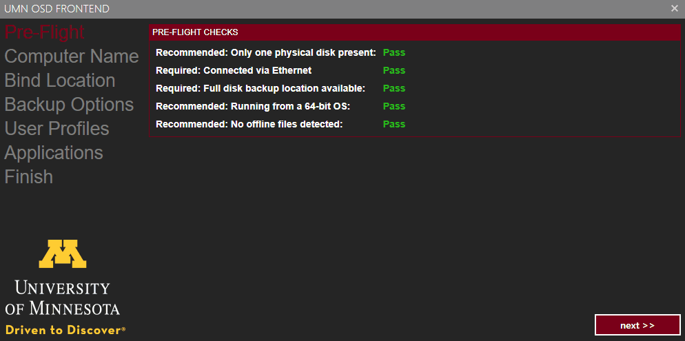

# UMN-OSDFrontEnd

This is a front end for SCCM OSD task sequences.



## Table of Contents

- [UMN-OSDFrontEnd](#umn-osdfrontend)
  - [Table of Contents](#table-of-contents)
  - [Build Status](#build-status)
  - [Dependencies](#dependencies)
  - [Usage](#usage)
    - [Production](#production)
    - [Test](#test)
  - [App Settings JSON](#app-settings-json)
    - [Example Json](#example-json)
    - [Logo](#logo)
    - [Web Service](#web-service)
    - [Computer Name Tab](#computer-name-tab)
    - [Computer Bind Tab](#computer-bind-tab)
    - [Pre Flight Check Tab](#pre-flight-check-tab)
    - [Backup Options Tab](#backup-options-tab)
    - [User Profiles Tab](#user-profiles-tab)
    - [Applications Tab](#applications-tab)
    - [Software Sections](#software-sections)

## Build Status

[](https://dev.azure.com/umn-microsoft/UMN-OSDFrontEnd/_build/latest?definitionId=3&branchName=master)


## Dependencies

- This project uses the [SCConfigMgr ConfigMgrWebService](https://www.scconfigmgr.com/configmgr-webservice/) which will need to be set up and running in order to properly leverage all the functionality of the front end.

## Usage

### Production

1. Download the [latest release](https://github.com/umn-microsoft-automation/UMN-OSDFrontEnd/releases/latest)
2. Unzip and [create a package](https://docs.microsoft.com/en-us/sccm/apps/deploy-use/packages-and-programs) in SCCM.
   * Create an AppSettings.json file (it can be called what you like) to define the properties you want in your front end.  See the section on app settings for more information.
   * Get the **ServiceUI.exe** from an MDT installation directory (C:\Program Files\Microsoft Deployment Toolkit\Templates\Distribution\Tools\x64 or x86) and make sure it's in your package source files.  For my own sanity I made seperate x86 and x64 folders for files specific to a bit level.
3. Create a new "Run Command Line" step in your task sequence.
   * Set the package to be the one you created in the previous step.
   * For the command line set it up something along these lines `x64\ServiceUI.exe -process:TSProgressUI.exe UMN-OSDFrontEnd.exe -s AppSettings.json`.
4. You may need two different front end steps for each bit level.
5. You can change configurations of the app using the json and include them in the package source then have different front ends for different situations.  In our task sequence we have one json configuration when the task sequence is run from Windows and a different configuration when run from WinPE as certain functions don't work or are not required when running from WinPE.

### Test

If you want to test using the front end all you need to do is create a configuration json file and then use the syntax `UMN-OSDFrontEnd.exe -dev -s AppSettings.json`.

## App Settings JSON

### Example Json

Check out the [example json](https://github.com/umn-microsoft-automation/UMN-OSDFrontEnd/blob/master/UMN-OSDFrontEnd/AppSettings.Example.json) which gives a general overview of how the file should be structured.

### Logo

Update is the logo so you can use your own.  Be careful not to select something too big as it may cover other portions of the UI.  You need to specify the width and height of your logo as well as where it's located.  This is a relative path to the executable.

```json
{
    "logoWidth": 175,
    "logoHeight": 137,
    "logoSource": "Resources/logo.png",
}
```

### Web Service

Change the web service to point to your instance of the [SCConfigMgr ConfigMgrWebService](https://www.scconfigmgr.com/configmgr-webservice/).

```json
{
    "webServiceURI": "this is your server hosting the SCConfigMgr Web Service (https://www.scconfigmgr.com/configmgr-webservice/)",
    "webServiceKey": "your_guid",
}
```

### Computer Name Tab

To configure the computer name tab add an entry to the tabs array with the **tabName** of **TabComputerName**.  Set enabled to true and then configure the computer name rules.  In the example below I use a less than or equal to 15 characters and greater than or equal to 5 characters.  You can also define a starts with or ends with rule.  Make sure you set the rule to be enabled if you want to use it.

```json
{
    "tabs": [
        {
            "tabName": "TabComputerName",
            "enabled": true,
            "ruleLessThan": 15,
            "ruleGreaterThan": 5,
            "ruleGreaterLessThanEnabled": true,
            "ruleStartsWith": "SW",
            "ruleStartsWithEnabled": true,
            "ruleEndsWith": "EW",
            "ruleEndsWithEnabled": false
        }
    ]
}
```
### Computer Bind Tab

Once you've enabled the computer bind tab setup your bind locations array.  The **rootName** will only be used as a display name for that node.  Then add an OU and every OU under that OU will be scanned an added.  Currently, only the base most OUs in that tree will be a valid bind location.  Every other node will not be selectable as a bind location.

```json
{
    "tabs": [
        {
            "tabName": "TabComputerBind",
            "enabled": "true",
            "bindLocations": [
                {
                    "rootName": "TestOU",
                    "ou": "OU=Test,OU=Computers,DC=domain,DC=example,DC=com"
                },
                {
                    "rootName": "TestOU2",
                    "ou": "OU=Test2,OU=Computers,DC=domain,DC=example,DC=com"
                }
            ]
        },
    ]
}
```

### Pre Flight Check Tab

Just like the other tabs, enable the pre flight tab and then set up the various pre flight checks you need.  Currently there are only five "checkers" that are available:
* physicalDiskCount
  * Checks the number of physical disks is below the defined limit.
* ethernetConnected
  * Checks to ensure that the device is connected to an Ethernet jack.
* networkConnectivityCheck
  * Pings a given IP address to ensure it's up and running.  Useful for confirming required network resources are available prior to starting an image.
* 64bitOS
  * Checks if the OS running the front end is 64 bit.
* offlineFilesDetected
  * Goes through the user profiles on the computer to determine if any have offline files enabled.

```json
{
    "tabs": [
        {
            "tabName": "TabPreFlight",
            "enabled": true,
            "preFlightChecks": [
                {
                    "checkName": "onePhysicalDisk",
                    "checkType": "physicalDiskCount",
                    "diskCheckLimit": 1,
                    "checkDescription": "Recommended: Only one physical disk present:",
                    "required": false
                },
                {
                    "checkName": "ethernetConnected",
                    "checkType": "ethernetConnected",
                    "checkDescription": "Required: Connected via Ethernet",
                    "required": true
                },
                {
                    "checkName": "fullDiskBackupLocation",
                    "checkType": "networkConnectivityCheck",
                    "checkDescription": "Required: Full disk backup location available:",
                    "required": true,
                    "networkAddress": "255.255.255.255"
                },
                {
                    "checkName": "runningFrom64bitOS",
                    "checkType": "64bitOS",
                    "checkDescription": "Recommended: Running from a 64-bit OS:",
                    "checkPassState": true,
                    "required": false
                },
                {
                    "checkName": "noOfflineFiles",
                    "checkType": "offlineFilesDetected",
                    "checkDescription": "Recommended: No offline files detected:",
                    "checkPassState": false,
                    "required": false
                }
            ]
        },
    ]
}
```

### Backup Options Tab

These are currently hard coded in and include a checkbox for WIM and USMT.

```json
{
    "tabs": [
        {
            "tabName": "TabBackupOptions",
            "enabled": true
        },
    ]
}
```

### User Profiles Tab

This tab is for removing user profiles from the device prior to imaging to help reduce the amount of data backed up in an autmatic backup task sequence.

```json
{
    "tabs": [
        {
            "tabName": "TabUserProfiles",
            "enabled": true,
            "domainUsersOnly": true,
            "userDomainPrefix": "ourdomain.local\\"
        },
    ]
}
```

### Applications Tab

This tab is a list of applications generated through the software secions settings which is a seperate entry from the tabs and will be detailed right below this section.

```json
{
    "tabs": [
        {
            "tabName": "TabApplications",
            "enabled": true
        },
    ]
}
```

### Software Sections

These are the application administrative categories (this can be set by right clicking on your application or using our [UMN-SCCMApplicationCategorization](https://github.com/umn-microsoft-automation/UMN-SCCMApplicationCategorization) tool) you've set in SCCM with a kinder name to present to consumers of your task sequence.  You can also buil a simple two level structure to group your entries into logical sections.

```json
{
"   softwareSections": [
        {
        "softwareSection": "Site License",
            "subCategories": [
                {
                    "categoryName": "Cloud Services",
                    "categorySCCM": "OSD - Cloud Services"
                },
                {
                    "categoryName": "General Software",
                    "categorySCCM": "OSD - General Software"
                }
            ]
        },
        {
        "softwareSection": "Free Software",
            "subCategories": [
                {
                    "categoryName": "Development",
                    "categorySCCM": "OSD - Free Development"
                },
                {
                    "categoryName": "Graphics",
                    "categorySCCM": "OSD - Free Graphics"
                }
            ]
        }
  ]
}
```
